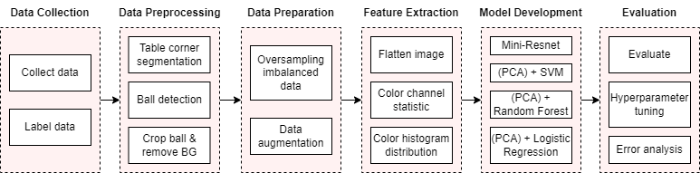
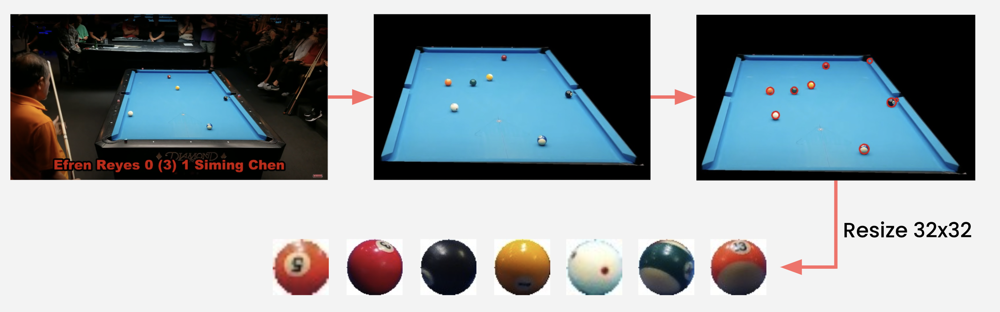
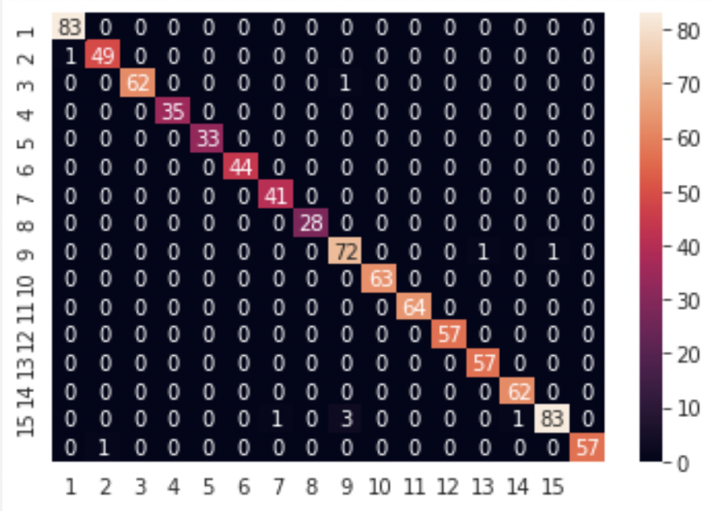

<div align='center'>

## An automated approach for Billiard balls detecting problem
</div>

🎃🎃 Our presentation towards this work is [here](https://docs.google.com/presentation/d/1uDUW7GX3hQ1FPUm9PiDUx8VAGn4Us663pElBj16rPug/edit#slide=id.g10997ba2ab3_0_394)       
🎃🎃 Our report towards this work is [here](https://github.com/ngctnnnn/Automated_billiards/report.pdf)

### Table of contents
1. [Introduction](#1-introduction)
2. [Method](#2-method)
3. [Results](#3-results)
---
This work is conducted by:
- [Tan Ngoc Pham](https://github.com/ngctnnnn)
- [Dzung Tri Bui](https://github.com/BTrDung)
- [Phuong Minh Nguyen](https://github.com)

```bibtex
@misc{automated-billiards,
    author = {Tan Ngoc Pham, Dzung Tri Bui, Phuong Minh Nguyen},
    title = {{Automated billiards}},
    year = {2021},
    publisher = {GitHub},
    journal = {GitHub repository},
    howpublished = {\url{https://github.com/thoth-ml/Automated_billiards}},
}
```


### 1. Introduction
- Our full approach is demonstrated as:

<div align='center'>


</div>

#### Dataset
- We collect data by ourselves with 41 images taken in real life and 79 images taken on Billiards' game on Youtube with 16 labels from $0$ to $15$ w.r.t. the number of the balls and white ball is labeled as $0$.

### 2. Method
#### 2.1. Billiard table detection
In order to increase the precision in detecting billiard balls, as well as locating billiard balls better for the classification phase, we propose to use **image segmentation** and **quadrilateral estimating** to detect billiard table.

##### Image segmentation
- Billiard tables normally have green or blue color with different properties on brightness and saturation. Hence, we conclude that image segmentation based on *Hue Saturation Value* (HSV) color model works better and more stable than *Red Green Blue* (RGB) color model does. Simple image segmentation method often limits blue and green color range based a defined range of colors on HSV channels. 

- Let denote the color value of the $i$-th pixel in an image as $p_i = \left(h_i, s_i, v_i\right)$, and the respective minimum and maximum value at each color channels in HSV model as $h_a, h_b, s_a, s_b, v_a, v_b$. The image segmentation algorithm would create a new binary image by the following equation:

<div align='center'>

$p'_i = 1 \Leftrightarrow \begin{cases} h_a \leq h_i < h_b \\ s_a \leq s_i < s_b \\ v_a \leq v_i < v_b \end{cases}$
  
</div>

- For a much easier approach, we choose to constrain the billiard boards as green and blue only. On green billiard boards, we setup the Hue range as $h_a = 80, h_b = 130$ and $h_a = 40, h_b = 70$ on blue ones. The Value parameters could also be set as $v_a = 60, v_b = 255$ since there is a similarity on the range of brightness in a typical image. 

- However, the saturation range is different between objects in any images and it is not good settling down a hard threshold on the Saturation value. We apply histogram statistical method and billiard table's color distribution estimating based on `Gaussian Mixture Model` (GMM). GMM could be simplified as a generalizing `K-means clustering` to embrace information on the data's covariance structure and the latent Gaussians centric points. In details, the input image would choose significant pixels after being segmentated on the above Hue and Value threshold. Then, we count and do statistics on the set of segmentated pixels to get the histogram of the blue ones. We could use GMM to estimate the distributions if colors in a photo appear as a set of Normal distributions. Here, we use $k = 2$ for Normal distributions and we choose the rightmost distribution in the histogram with the fundamental that billiard tables often have darker blue and more noticeable than the foreground.

##### Quadrilateral estimation 
The most important and decisive step in the table detection is to identify the billiard table's corners. We use `Suzuki algorithm` to find the appropriate borderlines to approximate the segmentated billiard table. Then, we use `Sklansky algorithm` to do the convex hull towards the billiard table and `Douglas-Peucker algorithm` to estimate the selected polygons into a quadrilateral with a minimum difference of $\epsilon$ between the original polygons and the detected quadrilateral. 

#### 2.2. Billiard balls detection
Billiard balls have to be detected as correctly as possible before moving to the classification step and should there be any mistakes, i.e. detecting holes instead of balls, our classification algorithms would not work effectively. We define the billiard balls detecting problem as receiving an input of the billiard board with the coordinate of four corners and an output of detected balls coordinates.

##### Preprocessing 
We propose a way to keep the surface of the billiard table only by removing the background of the original image using the tables' four corners coordinates. This would help our algorithm avoid round but non-ball objects.

##### Ball detection 
We use `Hough transformation` to detect round objects, or billiard balls in this context.

<div align='center'>



**Procedure from input image to detected balls**
</div>

#### 2.3. Billiard balls classification
We choose to use different approaches on classifying billiard balls in order to give out a minor comparison on performance among various Machine Learning algorithms and Deep Learning architecture. In this work, we utilise `Support Vector Machine` (SVM), `Random Forests` (RF), `Logistic Regression` with different feature extraction methods which are `Flatten`, `Color channel statistic`, and `Color histogram distribution`. Besides, we also use `miniResNet` as a competitive Deep Learning method to compare with supervised learning approaches.

### 3. Results:

<div align='center'>


**Final results on our experiments towards the problem**
</div>

<div align='center'>


**Confusion matrix on our data**
</div>
